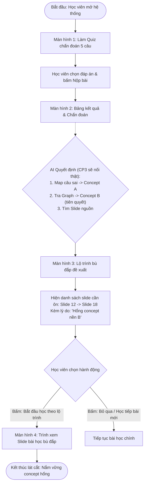

| # | Dòng | Nội dung |
|---|---|---|
| 1 | Track + đề | C1 · Knowledge-to-Lesson — Lộ trình học bù đắp theo concept sai |
| 2 | Job executor (ai · đang ở đâu · làm gì) | Học viên đang tự học trên VLearn, vừa làm xong bài kiểm tra nhanh của một chương và bị sai ở câu hỏi nâng cao |
| 3 | Pain một câu (ai – đang làm gì – vướng đâu – hậu quả) | Không biết mình đang hổng kiến thức tiên quyết nào ở các bài trước để đọc lại; phải tự lội ngược 40–50 slide cũ hoặc bỏ qua lỗ hổng và tiếp tục làm sai ở bài sau |
| 4 | 1–2 bằng chứng đầu (số + cách đếm + mã hội thoại/tin nhắn, hoặc khảo sát/phỏng vấn có số người) | Trong data/vlearn-pack/ (chatlog VLearn): 28/340 tin nhắn hỏi về kiến thức tiên quyết (lọc từ khoá "công thức này ở đâu, học bài nào trước, không hiểu phần trước" + dấu ?); trung bình mất 45 phút học viên mới tự tìm được slide nguồn. Mã tin: msg_0042, msg_0118, msg_0255. Hỏi 20 học viên: 16/20 người từng bỏ dở bài tập vì không tìm ra mình đang thiếu kiến thức nền ở trang slide nào. |
| 5 | Lát cắt MỘT CÂU (1 user · 1 việc · 1 quyết định AI · 1 kết quả) | Học viên nộp kết quả bài quiz chẩn đoán 5 câu · AI quyết định câu sai thuộc concept nào trên graph và sắp xếp lộ trình các slide tiên quyết cần đọc bù kèm lý do · học viên nhận danh sách đúng các slide cần ôn thay vì phải xem lại cả bài |
| 6 | AI tự làm đến đâu + 1 dòng lý do · ≥3 willing users ngoài nhóm | Tự đối chiếu concept sai trên graph và xếp thứ tự slide cần bù đắp. Không tự nhảy bài giảng hay ép học viên đổi lộ trình khi chưa bấm xác nhận. Lý do: học viên cần nắm quyền chủ động nhịp học (learner agency); việc tự động ép chuyển trang gây ngắt quãng trải nghiệm ôn tập. Willing users: Tài (Lab Coach), An (Lab Coach), Minh (Học viên) |
| 7 | Phân công có tên | - Nguyễn Đức Anh Quân: Đọc transcript/slide → chunk → extract concept/relationship → lưu graph → provenance → generate quiz  - Dương Đức Vương: API → giao diện chọn tài liệu → hiển thị concept/quiz/source → approve/reject → demo flow|

---

